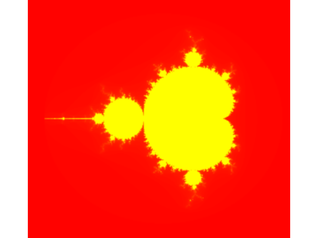

# Plotting the Mandelbrot Fractal

The very first thing I did when learning Python. This goes back to 2017. I found it while tidying some docs and just wanted to keep it here to remind me of the joy of programming 🥹.

I am adding venv packages specifications with poetry for easy reproducibility, but clearly it does not uses anything fancy.

It is full of comments in Spanish, which is just cute. I am keeping everything as it was. I am even keeping that ugly colormap, I remember spending an entire afternoon choosing it back then 😊.

Feel free to use it for anything.